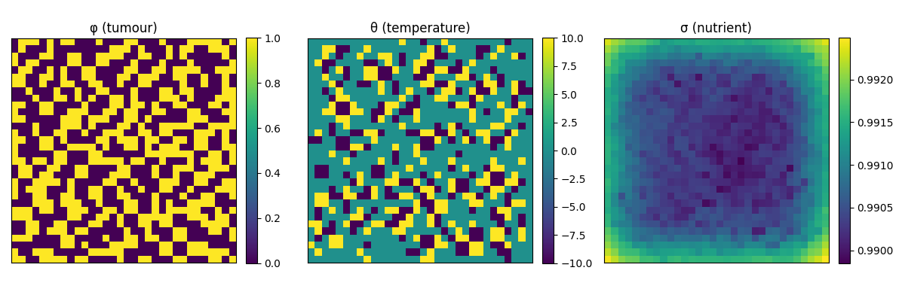
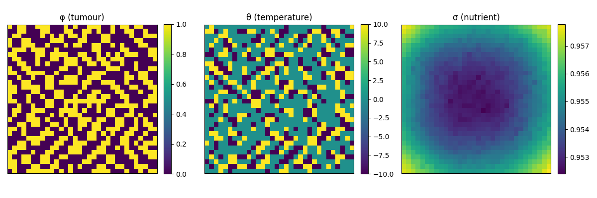
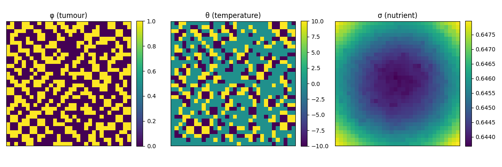

<div align="center">
  
</div>

# Non‑isothermal Allen–Cahn tumour growth model

[](https://pypi.org/project/acthermal-tumor/)


A reproducible, high–performance simulator for the **non‑isothermal Allen–Cahn tumour growth model**. This package
implements a three‑variable partial differential equation system coupling tumour cell concentration, temperature and
nutrient dynamics. The continuous model is derived in [Gatti *etal.*](https://doi.org/10.3934/cpaa.2026043) and
describes the interplay of tumour proliferation, apoptosis, nutrient consumption and heat conduction. The equations are
implemented in JAX and solved with either the `exponax` pseudo‑spectral framework (if available) or a fallback
finite–difference scheme.

## Simulation Progression and Interpretation

To illustrate the dynamical behaviour of the non-isothermal Allen–Cahn tumour model, we present simulation snapshots at
three different time horizons:

* **200 steps** (early stage)
* **1000 steps** (intermediate stage)
* **10000 steps** (late stage / quasi-steady state)

These correspond to increasing physical time and reveal how the coupled fields ($\varphi$) (tumour), ($\theta$) (
temperature), and ($\sigma$) (nutrient) co-evolve.

### Early Stage (≈ 200 steps)

 

At early times, the tumour is still close to its initial condition (typically a small localized region).

* The tumour interface is **sharp but beginning to diffuse** due to the Allen–Cahn term ($\Delta \varphi - F'(
  \varphi)$).
* Temperature ($\theta$) starts to increase locally where tumour growth occurs because of the source term (
  $\varphi_t^2$).
* Nutrient ($\sigma$) remains **nearly uniform**, with only slight depletion near the tumour.
  $\varphi_t^2$).

**Interpretation:**
This regime is dominated by **interface relaxation and initial proliferation**. The system has not yet developed strong
nonlinear feedback.

---

### Intermediate Stage (≈ 1000 steps)

  

At intermediate times, nonlinear coupling becomes significant.

* The tumour region **expands and smooths**, with curvature-driven motion of the interface.
* Temperature shows **localized hotspots** correlated with active tumour growth.
* Nutrient depletion becomes **clearly visible**, especially inside the tumour bulk.

**Interpretation:**
This stage reflects **active tumour growth under resource constraints**. The coupling term
$$
(P\sigma - A)h(\varphi)
$$
starts to regulate growth: regions with lower nutrient slow down or stabilize.

---

### Late Stage / Quasi-Steady State (≈ 10000 steps)

  

At long times, the system approaches a steady or metastable configuration.

* The tumour profile stabilizes into a **diffuse but stationary structure**.
* Temperature equilibrates through diffusion ( \nabla \cdot (\kappa(\theta)\nabla\theta) ).
* Nutrient reaches a **balance between consumption and supply**:
  $$
  -C\sigma h(\varphi) + B(\sigma_B - \sigma) \approx 0
  $$

**Interpretation:**
The system reaches a **dynamic equilibrium** where:

* tumour growth is balanced by apoptosis and nutrient limitation,
* temperature production is balanced by diffusion,
* nutrient consumption is balanced by vascular supply.

This corresponds to a **homeostatic tumour state** in the model.

---

### Key Observations

* The model exhibits **strong nonlinear coupling** between tumour growth, metabolism (nutrient), and thermodynamics (
  temperature).
* Tumour evolution is **not purely diffusive**; it is regulated by resource availability and internal feedback.
* Long-term behaviour depends critically on parameters ($P, A, C, B, \sigma_B$). Adjusting these can lead to different
  growth patterns, steady states or even tumour regression.

---

### Reproducing These Results

You can reproduce similar trajectories using:

```bash
python examples/basic_3d_simulation.py
```

## Mathematical model

The simulator solves the simplified non-dimensional system of coupled PDEs (equations(3.3) in the reference). Under
homogeneous Neumann boundary conditions, the model reads

```text
φ_t = Δφ − F′(φ) + θ + (P σ − A) h(φ),
θ_t = ∇·(κ(θ)∇θ) + (φ_t)^2 − θ φ_t,
σ_t = Δσ − C σ h(φ) + B (σ_B − σ),
```

where `φ` is the tumour cell concentration, `θ` the absolute temperature, and `σ` the nutrient concentration. The terms
on the right–hand side correspond to diffusion, a double-well potential (F), thermal coupling and reaction/source
mechanisms. The governing equations come from the derivation in the reference; in particular the authors show that,
after non-dimensionalisation and setting (c_V=β=ε=1), the model reduces to the above system.

### Constitutive functions

The simulator uses the following constitutive relations, taken directly from the physical model:

* **Double-well potential:** The bulk free energy is (F(φ)=φ^2(1−φ)^2). Its derivative appears in the Allen–Cahn
  equation and is given by (F′(φ)=4φ^3−6φ^2+2φ).
* **Activation function `h`:** The tumour regulates proliferation and apoptosis through a bounded, monotonic increasing
  function `h`. Biologically, one expects (h(0)=0) and (|h(r)|+|h′(r)|≤C); in practice we implement a smooth ramp
  that approximates (\max(0,φ)). These properties ensure that the source terms remain bounded and reflect the
  underlying biology.
* **Heat conductivity:** The heat conduction coefficient is (κ(θ)=1+|θ|^q) for some exponent
  (q≥2). By default the simulator uses `q=2` but this can be changed via the parameter
  dataclass.

The positive constants `P`, `A`, `C`, `B` and `σ_B` respectively denote the tumour proliferation rate, the apoptosis
rate, the nutrient consumption rate, the blood–tissue transfer rate and the nutrient concentration in the
vasculature. When `(P σ − A) > 0` the tumour grows; otherwise it decays. The nutrient equation combines consumption
`C σ h(φ)` with supply `B(σ_B−σ)`. Homogeneous Neumann boundary conditions (zero normal fluxes) are imposed for all
fields.

## Package structure

The repository is organised as follows:

- **`src/acthermal_tumor/core.py`** – constitutive functions, discrete differential operators and the right‑hand side of
  the PDE system.
- **`src/acthermal_tumor/solver.py`** – a high‑level `ThermalTumorSimulator` class that builds the computational grid,
  initializes state variables and advances the solution using a fourth–order Runge–Kutta scheme. The solver uses
  `exponax` to build spectral Laplacians when the library is available; otherwise it falls back to a finite–difference
  implementation of the Laplacian and divergence operators with Neumann boundary conditions.
- **`src/acthermal_tumor/parameters.py`** – a dataclass encapsulating all physical parameters and numerical settings.
- **`src/acthermal_tumor/utils.py`** – helper routines for generating initial conditions and plotting simulation output.
- **`tests/`** – a small pytest suite that checks basic stability (e.g. no `NaN` values after a few time steps).
- **`docs/`** – introductory documentation and usage examples.

## Installation

The package uses [PEP517](https://peps.python.org/pep-0517/) build isolation via **hatchling**. To install the
development version locally, clone this repository and run:

```bash
pip install .[dev]
```

This will install the simulator along with its optional test dependencies. You can then run the test suite with
`pytest`.

## Quick start

The following example sets up a two‑dimensional grid, initializes a small circular tumour and runs the simulator for a
few time steps. See `docs/index.md` for a detailed tutorial.

```python
import jax.numpy as jnp
from acthermal_tumor.parameters import Parameters
from acthermal_tumor.solver import ThermalTumorSimulator
from acthermal_tumor.utils import generate_initial_conditions, plot_state

# Define domain and parameters
shape = (64, 64)  # 2D grid
params = Parameters(
    P=2.0,
    A=1.0,
    C=1.0,
    B=0.5,
    sigma_B=1.0,
    q=2,
    dt=1e-3,
    dx=1.0 / 64
)

# Generate initial conditions: tumour in the centre, uniform temperature and nutrient
phi0, theta0, sigma0 = generate_initial_conditions(shape, radius_fraction=0.1)

# Create and run simulator
sim = ThermalTumorSimulator(shape=shape, params=params)
state = sim.initialize_state(phi0, theta0, sigma0)
for _ in range(100):
    state = sim.step(state)

# Plot the final state
plot_state(state)
```

## Contributing

Contributions that improve accuracy, extend functionality or add additional time steppers are welcome. Please open an
issue or pull request on the project repository.